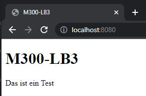

Apache Server
===

Beim ausführen dieses Dockerfile wird ein Container erstellt, der einen Apache-Webserver und eine HTML-Seite bereitstellt. Der Benutzer kann auf diese Anwendung über einen Webbrowser zugreifen und die HTML-Seite mit der Nachricht "Das ist ein Test" anzeigen lassen.

### **Dockerfile**
In diesem Dockerfile wird das neueste Ubuntu-Basisimage als Grundlage verwendet, anschließend werden der Apache-Webserver und das curl-Programm installiert, die Konfigurationsdatei des Apache-Servers aktualisiert, die index.html-Datei in das Verzeichnis /var/www/html kopiert und der Container auf Port 8081 freigegeben. Abschließend wird der Befehl zum Starten des Apache-Servers definiert.

### **apache.conf**
Die apache.conf-Datei ist eine Konfigurationsdatei für den Apache-Webserver, die die grundlegenden Einstellungen für den Webserver definiert. Hier wird der Servername auf "localhost" und das Dokumentenverzeichnis auf "/var/www/html" gesetzt. Darüber hinaus werden die Berechtigungen für das Verzeichnis definiert, damit der Apache-Server auf die Dateien im Verzeichnis zugreifen und sie bereitstellen kann.

### **index.html**
Die index.html-Datei ist eine statische HTML-Seite, die im Apache-Webserver-Verzeichnis /var/www/html platziert wird. Sie enthält eine einfache HTML-Struktur mit einem Titel "M300-LB3" und einem Absatztext "Das ist ein Test". Wenn der Apache-Webserver gestartet ist, kann diese Seite im Webbrowser über die Adresse "localhost:8081" aufgerufen werden.

### **Erstelle ein Image**
```
docker build -t mein-image .
```


### **Erstelle ein Container**
```
docker run -d --name mein-container -p 8080:80 mein-image
```


### **Wichtig!**
Die drei Dateien müssen sich im selben Verzeichnis befinden und der Benutzer muss im selben Verzeichnis sein, um die Befehle erfolgreich auszuführen.

Dies kann man überprüfen, indem man unter: http://localhost:8080  geht und testet.

