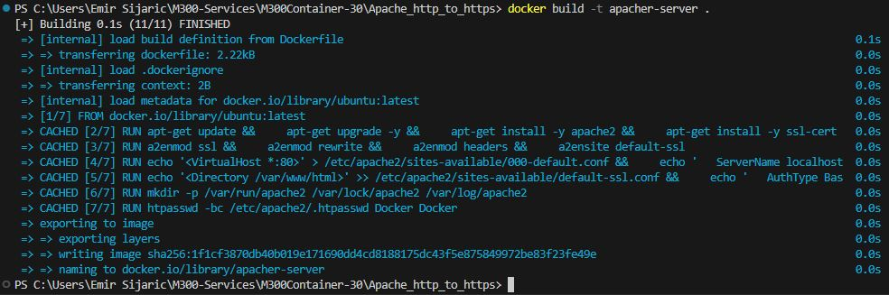
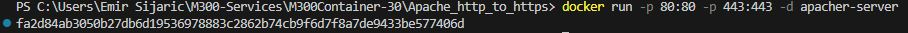
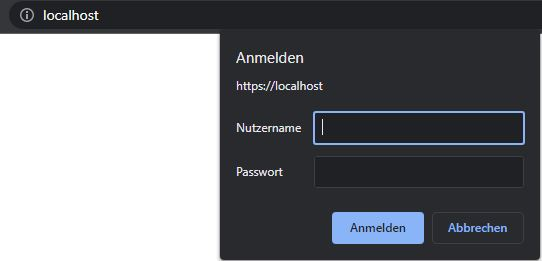
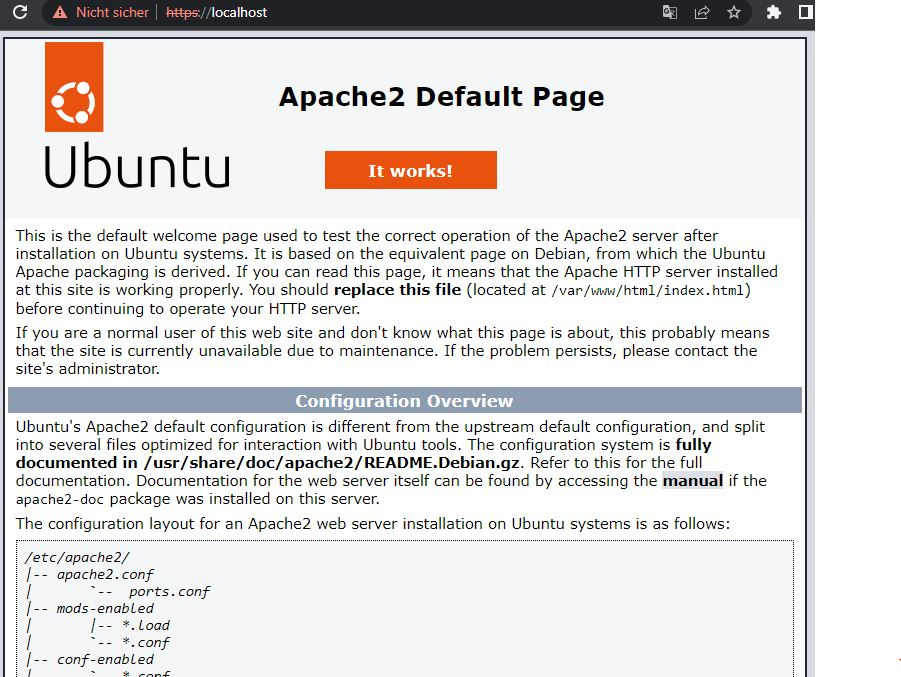

Apache HTTP to HTTPS
===

Dieser Dockerfile erstellt ein Docker-Image, das den Apache-Webserver mit aktiviertem SSL-Modul und Basis-Authentifizierung verwendet. Der Apache-Webserver wird im Vordergrund gestartet und die Ports 80 und 443 werden freigegeben.

### **Schritte**

1. Verwende das neueste offizielle Ubuntu-Image als Basis.
2. Setze den Maintainer des Images auf Apache.
3. Installiere den Apache-Webserver, SSL-Zertifikate und apache2-utils.
4. Aktiviere notwendige Apache-Module (ssl, rewrite, headers) und das SSL-Standard-Site.
5. Erstelle eine Umleitungsregel von Port 80 auf 443 in einer .conf-Datei.
6. Füge die Authentifizierungsanweisungen zur SSL-Konfigurationsdatei hinzu.
7. Setze die Umgebungsvariablen für Apache.
8. Erstelle notwendige Verzeichnisse für Apache.
9. Erstelle eine .htpasswd-Datei mit Basis-Authentifizierung.
10. Exponiere Ports 80 und 443.
11. Starte den Apache-Webserver im Vordergrund.

### **Verwendung**
Das erstellte Docker-Image kann verwendet werden, um einen Apache-Webserver mit SSL-Unterstützung und Basis-Authentifizierung in einem Docker-Container bereitzustellen. Die Ports 80 und 443 müssen freigegeben werden, damit der Container von außen erreichbar ist.

### **Erstelle ein Image**
```
docker build -t <image-name> .
```



### **Erstelle ein Container**
```
docker run -p 80:80 -p 443:443 -d <image-name>
```



Wenn man jetzt die Seite aufruft: http://localhost, dann sollte man direkt zu https weitergeleitet werden und nach einem User Login abgefragt werden.


