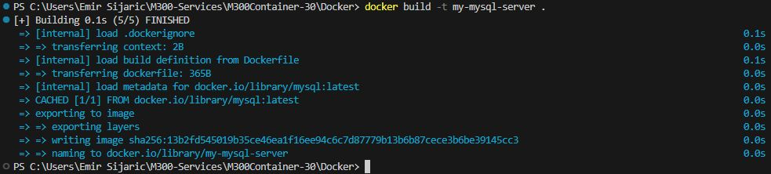
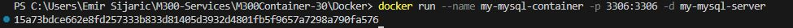

Dockerfile MySQL
===

Dieser Dockerfile erstellt ein Image für einen MySQL-Server mit vordefinierten Benutzer- und Datenbankinformationen.

### **Details**
Der Dockerfile basiert auf dem offiziellen MySQL-Image, das über Docker Hub bereitgestellt wird. Es wird eine Datenbank namens mydatabase erstellt und ein Benutzer mit den Zugangsdaten user:123456 angelegt. Der MySQL-Server wird auf Port 3306 freigegeben und automatisch gestartet, wenn der Docker-Container gestartet wird.

### **Erstelle ein Image**
```
docker build -t my-mysql-server .
```



### **Erstelle ein Container**
```
docker run --name my-mysql-container -p 3306:3306 -d my-mysql-server
```



Im Docker muss man dann dies überprüfen und es sollte so aussehen:

