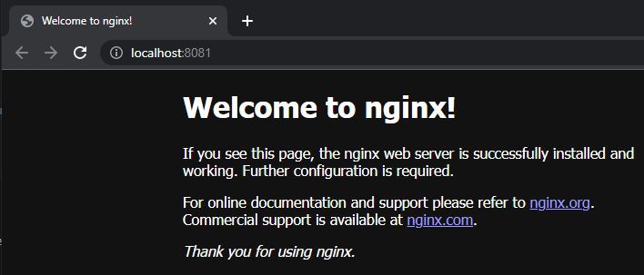

Cluster
===
Diese YAML-Datei definiert eine Kubernetes-Deploymentkonfiguration mit einem "master"- und zwei "worker"-Pods, die die nginx-Image verwenden. Jeder Pod hört auf Port 80 und hat spezifische CPU- und RAM-Ressourcenlimits. Es gibt auch zwei Services, "master-service" und "worker-service", die ClusterIP-Typ sind und auf Port 80 hören. Der "master-service" ist mit dem "master"-Pod und der "worker-service" ist mit den "worker"-Pods verbunden.

### **Erstelle Kubernetes Apache-Server**
```
kubectl apply -f Cluster.yaml
```


### **Lösche denn erstellten Apache-Server**
```
kubectl delete -f Cluster.yaml
```

### **Port-Forward um den Cluster zu testen**
```
kubectl port-forward service/master-service 8080:80  
kubectl port-forward service/worker-service 8081:80   
```


### **Info**
Nachdem erstellen des Clusters und dem Port-Forward können die Worker unter dem Link http://localhost:8081 abgerufen werden und der Master unter http://localhost:8080

