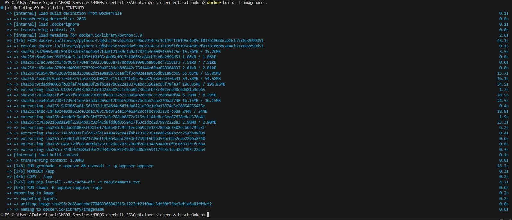
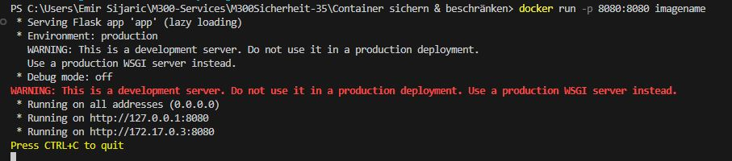
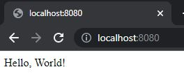
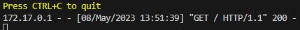

Container sichern & beschränken
===

Das Dockerfile nutzt ein schlankes Python-3.9 Basisimage, um den Container klein zu halten und die Angriffsfläche zu reduzieren. Die Einschränkung der Berechtigungen durch die Erstellung eines eigenen Benutzers und die Verwendung einer requirements.txt-Datei minimieren die Angriffsfläche zusätzlich und erhöhen die Sicherheit der Anwendung.

### **Erstelle ein Image**
```
docker build -t imagename .
```


### **Erstelle ein Container**
```
docker run -p 8080:8080 imagename
```



Wenn man jetzt auf die Webseite geht http://localhost:8080 sieht man eie Webseite mit einem hello world, sowie das dies protokolliert wird im Terminal.
 