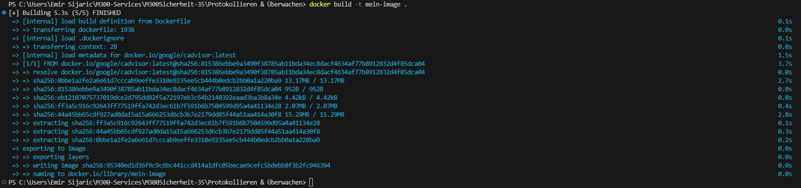
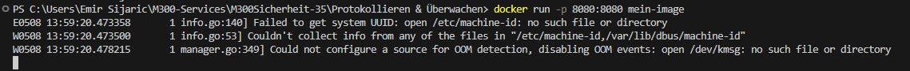
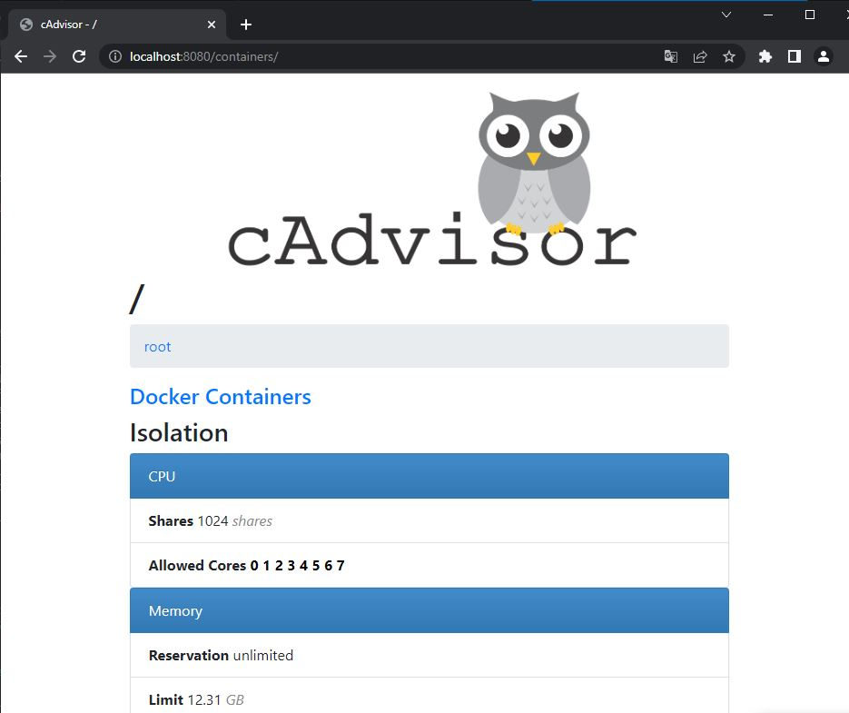

Protokollieren & Überwachen
===

Dies ist ein Dockerfile, das auf dem google/cadvisor-Image basiert und cAdvisor in einem Container bereitstellt. Der Port 8080 wird freigegeben, um auf die cAdvisor-Web-Schnittstelle zugreifen zu können. Der Befehl CMD startet cAdvisor mit den Optionen --logtostderr und --port=8080.

### **Erstelle ein Image**
```
docker build -t mein-image .
```



### **Erstelle ein Container**
```
docker run -p 8080:8080 mein-image
```



Zum Schluss sollte man das hier sehen, wenn man den link: http://localhost:8080/containers/ öffnet.

