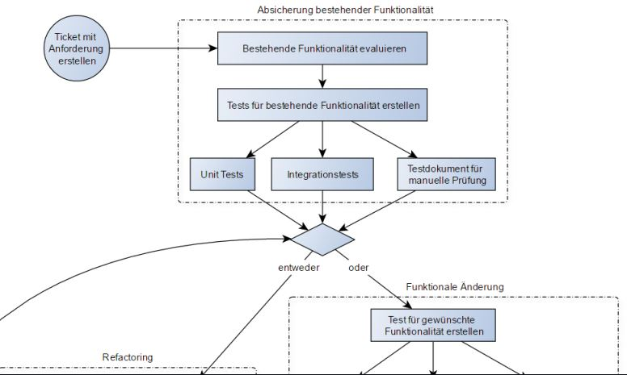

M300 - 35 Container-Sicherheit
=== 
Protokollieren & Überwachen
===

In der Informatik ist die Sicherheit immer an der ersten Stelle. Darum sollte man ebenfalls bei den Container auf die Sicherheit achten. Bei Komplexen Systemen zb. (Wenn mehrere Container mit eineinander verbunden sind.)  ist es natürlich noch wichtiger, dass die Systeme reibbungslos laufen. 

Für die Sicherheit der Container ist das protokollieren einer der Wichtigsten Punkten. Wenn man keine Logging-Software angegeben hat, protokolliert Docker nur das was an STDOUT STDERR geschickt wird.

Wenn du eine Anwendung in einem Docker-Container startest, kannst du das Verhalten der Anwendung überwachen, indem du die Ausgabe auf die Standardausgabe (STDOUT) oder die Standardfehlerausgabe (STDERR) sendest. STDOUT und STDERR sind Kanäle, über die Anwendungen mit der Umgebung kommunizieren. STDOUT wird normalerweise für die normale Ausgabe von Anwendungen verwendet, während STDERR für Fehlermeldungen und Warnungen verwendet wird.

Docker protokolliert standardmäßig alles, was an STDOUT oder STDERR geschickt wird, und speichert die Ausgabe in einem Container-Log-File. Dieses Log-File kann dann verwendet werden, um das Verhalten der Anwendung zu überwachen oder Probleme zu erkennen.

Sinnvoll ist natürlich, dass man diese Logs dann auch anschauen kann. Dazu muss man folgenden Behfel eingeben:

```
docker logs
```

| Logging-Methode | Beschreibung                                                                                     |
|----------------|-------------------------------------------------------------------------------------------------|
| json-file       | Diese Methode schreibt die Container-Logs als JSON-Datei auf die Festplatte des Host-Systems.   |
| syslog          | Diese Methode schickt die Logs an das System-Logging-Tool (syslog) des Host-Systems.           |
| journald        | Diese Methode schickt die Logs an das System-Logging-Tool (journald) des Host-Systems.         |
| splunk          | Diese Methode schickt die Logs an eine Splunk-Instanz. Splunk ist eine Software zur Analyse von Maschinendaten. |
| awslogs         | Diese Methode schickt die Logs an Amazon CloudWatch Logs. CloudWatch Logs ist ein verwalteter Log-Service von Amazon Web Services. |

Diese Liste ist nicht vollständig und es gibt noch weitere Logging-Methoden, die man über --log-driver auswählen kann. Man kann auch eigene Logging-Methoden implementieren, indem man ein Docker-Plugin erstellt.

### Wichtige Behfehle für Standard-Logging ###

| Befehl                                | Beschreibung                                                                                                                                                                      |
|--------------------------------------|----------------------------------------------------------------------------------------------------------------------------------------------------------------------------------|
| `$ docker run --name logtest ubuntu bash -c 'echo "stdout"; echo "stderr" >>2'` | Startet einen neuen Container `logtest` auf Basis des `ubuntu`-Images. Der Befehl gibt "stdout" auf STDOUT aus und gibt "stderr" auf STDERR aus. |
| `$ docker logs logtest`               | Zeigt die Logs des Containers `logtest` an.                                                                                                                                        |
| `$ docker rm logtest`                 | Entfernt den Container `logtest`.                                                                                                                                                  |
| `$ docker run -d --name streamtest ubuntu bash -c 'while true; do echo "tick"; sleep 1; done;'` | Startet einen neuen Container `streamtest` auf Basis des `ubuntu`-Images. Der Befehl gibt alle Sekunde "tick" aus. |
| `$ docker logs streamtest`            | Zeigt die Logs des Containers `streamtest` an.                                                                                                                                     |
| `$ docker logs streamtest \| wc -l`   | Zählt die Anzahl der Zeilen in den Logs des Containers `streamtest`.                                                                                                              |
| `$ docker rm streamtest`              | Entfernt den Container `streamtest`.                                                                                                                                                |

Protokollierung System-Log des Hosts:
```
    docker run -d --log-driver=syslog ubuntu bash -c 'i=0; while true; do i=$((i+1)); echo "docker $i"; sleep 1; done;'
```
```
    $ tail -f /var/log/syslog
```

### Überwachen und Benachrichtigen ###

Wenn man als System Administrator bei einem Microservices-System arbeitet, ist man um jede Hilfe froh. Deswegen werden in solchen grossen unternehmen immer Benachrichtungen integriert. Damit man eine Benachrichtung bekommt, wenn ein System schiefläuft. Damit man nicht Hunderte oder Tausende Container aufeinmal im überblick haben muss, gibt es zum beispiel "Container Advisor". Dieses Tool von Google ermöglicht es alle Systeme auf einen Blick zu sehen. Somit ist die Warscheindlichkeit kleiner, dass ein System den Geist aufgibt.

 Da cAdvisor selbst als Container zur Verfügung steht, können wir das Tool in kürzester Zeit zum Laufen bringen. Gestartet wird der cAdvisor-Container mit folgenden Argumenten:

    $ docker run -d --name cadvisor -v /:/rootfs:ro -v /var/run:/var/run:rw -v /sys:/sys:ro -v /var/lib/docker/:/var/lib/docker:ro -p 8080:8080


 
Container sichern & beschränken
===


## Sicherheitsprobleme ##


## Berechtigungs-Verteilung ##

**Kernel Exploits** <br>
Im Gegensatz zu einer Virtual Machine wird der Kernel von Containern gemeinsam mit dem Host verwendet, wodurch Schwachstellen im Kernel erhebliche Auswirkungen haben können. Sollte ein Container eine Kernel Panic verursachen, führt das zum Absturz des gesamten Hosts. In VMs ist die Situation besser, da ein Angreifer sowohl den VM-Kernel als auch den Hypervisor angreifen müsste, bevor er auf den Host-Kernel zugreifen kann.

**Denial-of-Service-(DoS-)Angriffe** <br>
Alle Container teilen sich die Ressourcen des Kernels. Wenn ein Container den Zugriff auf bestimmte Ressourcen für sich beansprucht, wie beispielsweise Speicher oder User IDs (UIDs), kann er die anderen Container auf dem Host blockieren und so einen Denial-of-Service-Angriff verursachen, bei dem berechtigte Benutzer das System nicht mehr nutzen können.

**Container-Breakouts** <br>
Wenn ein Angreifer Zugriff auf einen Container erhält, sollte er nicht in der Lage sein, auf andere Container oder den Host zuzugreifen. Da die Benutzer nicht durch Namensräume getrennt sind, erben alle Prozesse, die aus dem Container ausbrechen, auf dem Host dieselben Privilegien wie im Container. Wenn man im Container root-Zugriff hat, hat man auch auf dem Host root-Zugriff. Privilege-Escalation-Angriffe müssen ebenfalls berücksichtigt werden, bei denen ein Angreifer mehr Rechte erhält, als ihm zustehen – oft durch einen Fehler im Anwendungscode, der zusätzliche Berechtigungen erfordert. Da sich die Container-Technologie noch in der Anfangsphase befindet, sollte man davon ausgehen, dass Container-Breakouts unwahrscheinlich, aber möglich sind.

**Vergiftete Images** <br>
Es ist schwierig zu wissen, ob die verwendeten Images sicher sind, nicht manipuliert wurden und von der erwarteten Quelle stammen. Ein Angreifer kann einen dazu bringen, sein manipuliertes Image auszuführen und somit sowohl den Host als auch die eigenen Daten gefährden. Es ist auch wichtig sicherzustellen, dass die ausgeführten Images aktuell sind und keine bekannten Sicherheitslücken aufweisen.

**Offengelegte Geheimnisse** <br>
Wenn ein Container auf einen Service oder eine Datenbank zugreift, muss er möglicherweise ein Geheimnis wie einen API-Schlüssel oder Benutzername und Passwort kennen. Wenn ein Angreifer auf dieses Geheimnis zugreifen kann, kann er auch den Service oder die Datenbank verwenden. Dieses Problem wird in einer Microservices-Architektur verschärft, da Container häufig gestoppt und neu gestartet werden. Im Vergleich zu einer Architektur mit einer begrenzten Anzahl von langlebigen VMs ist dies ein erhöhtes Risiko.

## Container absichern ##

Natürlich können die konkreten Schritte zur Absicherung von Containern je nach Anwendungsfall und Umgebung variieren, aber hier sind einige konkrete Beispiele:

1. Verwenden von Images von vertrauenswürdigen Quellen oder von internen Registern, um sicherzustellen, dass die Images keine Malware oder andere bösartige Software enthalten.

2. Vermeiden von der Ausführung von Containern mit root-Privilegien, um zu verhindern, dass Angreifer auf Kernel-Ebene oder darüber hinaus gelangen können.

3. Begrenzen von Ressourcen (z.B. Speicher oder CPU) für jeden Container, um DoS-Angriffe und andere Arten von Ressourcenverbrauch zu verhindern.

4. Verwenden von Network Policies, um die Netzwerkkommunikation zwischen Containern oder von Containern zum Host-System zu beschränken.

5. Überwachen von Container-Logs und Ereignissen, um verdächtige Aktivitäten oder Anomalien zu erkennen und darauf zu reagieren.

6. Aktualisieren von Images und Containern auf die neuesten Versionen, um sicherzustellen, dass Sicherheitslücken oder Schwachstellen behoben wurden.

7. Verwendung von Verschlüsselung für die interne Kommunikation zwischen Containern oder für die Speicherung von Daten in Containern.

8. Einschränken des Zugriffs auf Host-Ressourcen wie Dateien oder Verzeichnisse durch die Verwendung von Volumes oder Bind Mounts mit gezielten Berechtigungen.

Weitere Massnahmen:

    Beim Einsatz sicherheitskritischer Container:

Weitere Sicherheitstipps
===

Container-Deployments bieten viele Vorteile, jedoch ist es auch wichtig, Sicherheitsmaßnahmen zu ergreifen, um Angriffe zu verhindern. In diesem Text werden verschiedene praktische Tipps zur Absicherung von Container-Deployments vorgestellt, die dazu beitragen können, Container-Umgebungen sicherer zu gestalten.

**Setzen von Usern** <br>
Es ist wichtig, das Verwenden von root-Accounts in Container-Deployments zu vermeiden. Daher sollten Sie immer einen Benutzer mit geringeren Rechten in den Dockerfiles erstellen und mit der USER-Anweisung auf diesen Benutzer wechseln. Dies kann mithilfe folgenden Beispiels in einem Dockerfile umgesetzt werden:
'''
RUN groupadd -r user_grp && useradd -r -g user_grp user
USER user
'''

**Beschränkung des Netzwerkzugriffs** <br>
Um das Risiko von Angriffen zu minimieren, sollten Sie sicherstellen, dass nur die Ports geöffnet werden, die tatsächlich benötigt werden. Diese Ports sollten auch nur für die anderen Container erreichbar sein, die sie brauchen.

**Entfernen von setuid/setgid-Binaries** <br>
Die Verwendung von setuid- oder setgid-Binaries kann zu einer unerlaubten Rechteausweitung führen. Daher sollten Sie diese Binaries deaktivieren oder entfernen.

**Begrenzung des Speichers** <br>
Eine Begrenzung des verfügbaren Speichers kann dazu beitragen, DoS-Angriffe und Anwendungen mit Speicherlecks zu verhindern, die nach und nach den Speicher des Hosts aufbrauchen

**Begrenzung des CPU-Einsatzes** <br>
Wenn ein Angreifer einen Container oder eine Gruppe von Containern dazu bringt, die CPU des Hosts vollständig auszulasten, kann dies zu einem DoS-Angriff führen. In Docker wird die CPU-Zuteilung über eine relative Gewichtung ermittelt.

[&uarr; nach oben](https://github.com/Emir-Sijaric/M300-Services)

Kontinuierliche Integration
===
Kontinuierliche Integration (CI) ist ein Prozess in der Software-Entwicklung, bei dem Komponenten einer Anwendung fortlaufend zusammengefügt werden. Das Ziel von CI besteht darin, die Qualität der Software zu verbessern. Der Prozess beinhaltet typischerweise das Übersetzen und Verknüpfen von Anwendungsteilen sowie die Durchführung von automatisierten Tests und die Erstellung von Software-Metriken zur Messung der Softwarequalität. Der gesamte Vorgang wird automatisch durch das Einchecken in die Versionsverwaltung ausgelöst.

Die folgenden Grundsätze sind entscheidend für eine erfolgreiche Umsetzung von CI:
1. Gemeinsame Codebasis
2. Automatisierte Übersetzung
3. Kontinuierliche Test-Entwicklung
4. Häufige Integration
5. Integration in den Hauptbranch
6. Kurze Testzyklen
7. Gespiegelte Produktionsumgebung
8. Einfacher Zugriff
9. Automatisiertes Reporting

**Unittest** <br>
Ein Modultest, auch bekannt als Komponententest oder Unittest, wird in der Softwareentwicklung angewendet, um die funktionalen Einzelteile (Module) von Computerprogrammen zu testen und ihre korrekte Funktionalität zu überprüfen.



**Jenkins & Blue Ocean** <br>
Travis CI ist ein Cloud-basiertes CI-System, das sich durch eine gute Integration mit GitHub auszeichnet.

Jenkins ist ein beliebter Open-Source-CI-Server. Die kontinuierliche Lieferung sollte mit Jenkins nicht schwierig sein. Blue Ocean ist ein Plugin für Jenkins, das die Benutzeroberfläche verbessert und Jenkins für die Bedürfnisse von normalen Entwicklern vereinfacht. Um Jenkins und Blue Ocean nutzen zu können, wird eine Applikation bzw. ein Service benötigt, die in einem Git-Repository gespeichert ist und im Repository selbst die Datei Jenkinsfile enthält.
